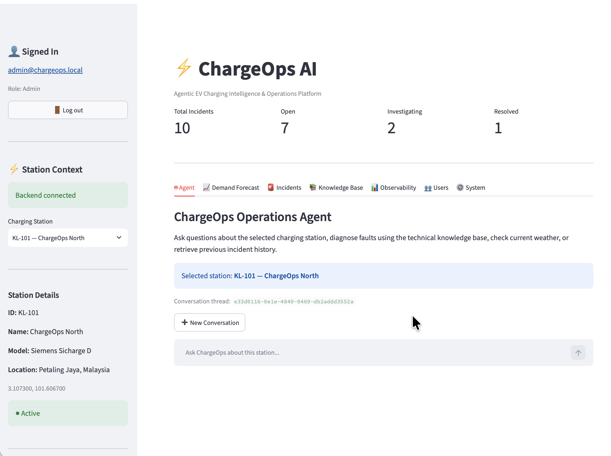
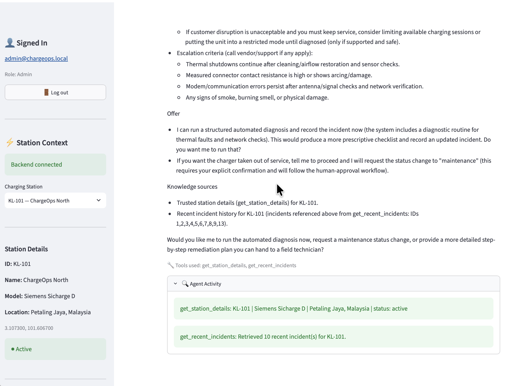
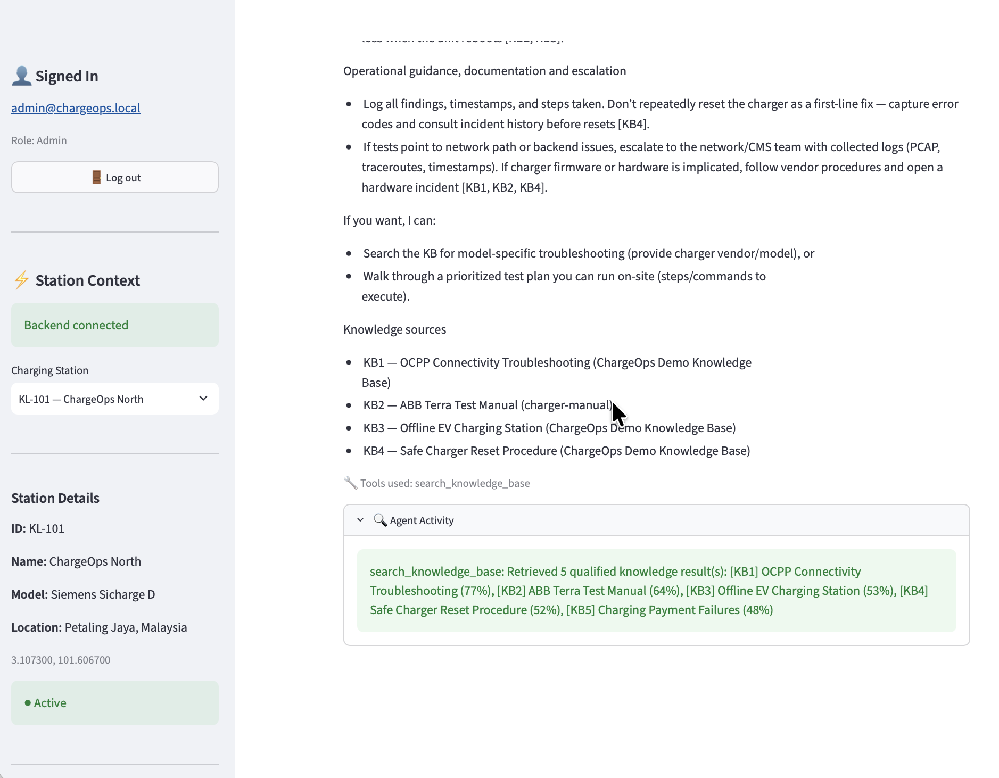
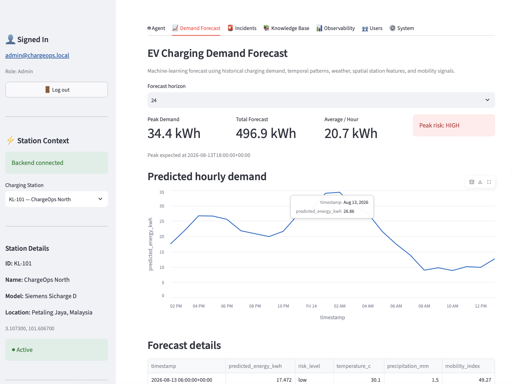
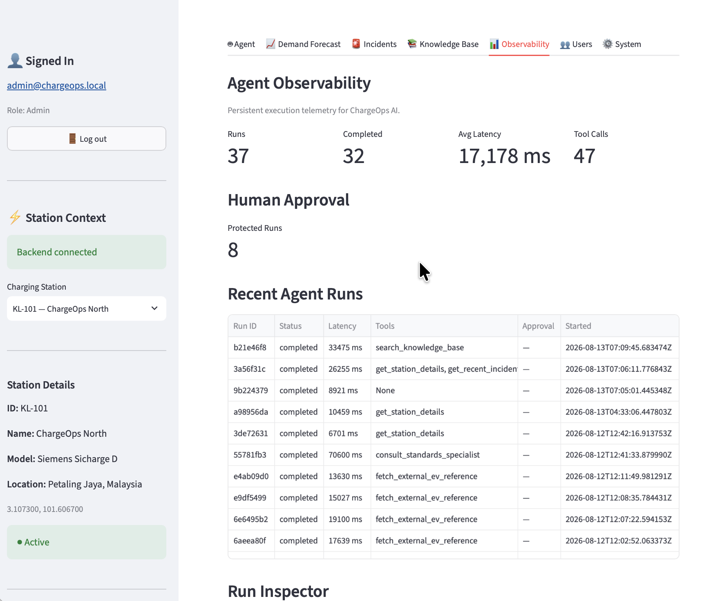
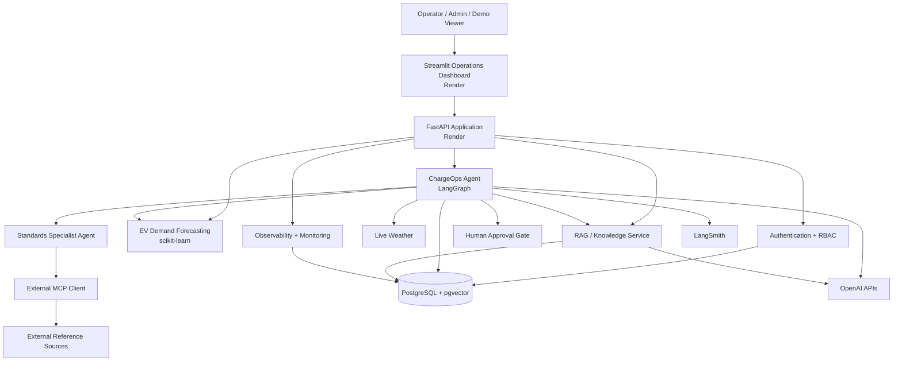

# ⚡ ChargeOps AI

**Agentic EV Charging Intelligence & Operations Platform**

[](https://github.com/zrasooli94/ChargeOps-AI/actions/workflows/ci-cd.yml)
[](https://www.python.org/)
[](https://fastapi.tiangolo.com/)
[](https://www.langchain.com/langgraph)
[](https://www.postgresql.org/)
[](https://www.docker.com/)

**Live application:** https://chargeops-frontend.onrender.com  
**Demo login:** [demo@chargeops.ai](mailto:demo@chargeops.ai)  
**Demo password:** `hyhsod-qiScec-5waxni`  
**API documentation:** https://chargeops-api.onrender.com/docs  
**Source:** https://github.com/zrasooli94/ChargeOps-AI

> **Portfolio note:** The public deployment uses free-tier cloud infrastructure, so the first request can take longer while services wake from an idle state.

---

## 🔐 Live Demo Access

The public ChargeOps deployment requires authentication.

Use the dedicated read-only portfolio account:

```text
Email: demo@chargeops.ai
Password: hyhsod-qiScec-5waxni
Role: Viewer
```

The demo account is intentionally restricted. It can explore station intelligence, safe agent workflows, demand forecasting, incidents, and knowledge retrieval, but it cannot perform privileged operational changes or administrative actions.

---

<p align="center">
  
</p>

---

## Overview

ChargeOps AI is a production-style Generative AI and Agentic AI platform for EV charging operations.

It combines a secure FastAPI backend, LangGraph-based agent orchestration, PostgreSQL + pgvector retrieval, machine-learning demand forecasting, human-in-the-loop operational controls, multi-agent standards research, authentication/RBAC, observability, Prometheus-compatible monitoring, Docker, CI/CD, and a Streamlit operations dashboard.

The goal is to demonstrate how an AI agent can operate against **trusted application state and real tools** rather than behave as a standalone chatbot.

---

## What ChargeOps Demonstrates

ChargeOps is designed around the kinds of concerns that matter in production AI engineering:

- **Agentic AI** with tool selection, conditional routing, persistent memory and multi-step workflows
- **Retrieval-Augmented Generation** using OpenAI embeddings and PostgreSQL/pgvector
- **Human-in-the-loop safety** for protected operational changes
- **Deterministic authentication and RBAC** outside the LLM
- **Multi-agent delegation** for standards/research workflows
- **Model Context Protocol (MCP)** integrations for external reference access
- **Machine-learning forecasting** for EV charging demand
- **Observability and evaluation** for model/tool behavior
- **Production monitoring** through health checks, correlated logs and Prometheus-compatible metrics
- **Containerized cloud deployment** with automated CI/CD

---

# Key Capabilities

## 🤖 Agentic EV Operations

The ChargeOps agent can reason over station context and choose tools including:

- `get_station_details`
- `get_recent_incidents`
- `get_station_weather`
- `search_knowledge_base`
- `diagnose_charging_issue`
- `change_station_status`
- demand-forecasting tools
- standards-specialist delegation

The agent uses trusted runtime context rather than asking the LLM to invent operational state.

<p align="center">
  
</p>

The agent can combine multiple tools in a single workflow, for example retrieving station metadata and recent incidents before producing an operational recommendation.

---

## 📚 Retrieval-Augmented Generation

ChargeOps includes a production-style knowledge pipeline:

```text
Document Upload
      ↓
Validation
      ↓
Text Extraction
      ↓
Normalization
      ↓
Chunking
      ↓
OpenAI Embeddings
      ↓
PostgreSQL + pgvector
      ↓
Semantic Retrieval
      ↓
Grounded Agent Answer
```

Knowledge features include:

- PDF, TXT and Markdown ingestion
- OpenAI `text-embedding-3-small`
- 1536-dimensional embeddings
- pgvector HNSW cosine-similarity indexing
- retrieval similarity thresholds
- result deduplication and diversity controls
- source labels and citations
- duplicate-document protection
- admin-only ingestion and deletion

<p align="center">
  
</p>

The public demo can show retrieved knowledge sources together with qualified similarity results, making the RAG workflow visible rather than hidden behind a generic chat interface.

---

## 📈 EV Charging Demand Forecasting

ChargeOps includes an EV demand forecasting subsystem built with scikit-learn.

The forecasting pipeline combines:

- historical charging demand
- temporal features
- weather features
- spatial/station features
- mobility signals
- lagged demand features

The UI provides:

- 24-hour demand forecasts
- predicted hourly energy demand
- peak demand
- total forecast demand
- average hourly demand
- risk classification

<p align="center">
  
</p>

> **Data disclosure:** The current public portfolio deployment uses simulated demonstration demand history to validate the forecasting and operational-intelligence pipeline. It should not be interpreted as production utility telemetry.

---

## 🧑‍⚖️ Human-in-the-Loop Operations

Protected station-status changes are never executed simply because an LLM requested them.

```text
User Request
    ↓
Agent Identifies Protected Action
    ↓
Server-side Authorization
    ↓
LangGraph Interrupt
    ↓
Human Approval Required
    ↓
Approve / Reject
    ↓
Resume Workflow
    ↓
Database Write Only If Authorized + Approved
```

The LLM cannot grant itself access.

This separates AI reasoning from application authorization and creates a deterministic safety boundary around operational writes.

---

# Authentication & RBAC

ChargeOps implements deterministic server-side authentication and authorization.

## Authentication

- PostgreSQL-backed users
- Argon2 password hashing
- JWT access tokens
- configurable token expiry
- active-account validation
- database role/account state checked on authenticated requests
- no public registration
- password hashes never returned by API responses

## Roles

| Capability | Viewer | Operator | Admin |
|---|:---:|:---:|:---:|
| View stations | ✅ | ✅ | ✅ |
| View incidents | ✅ | ✅ | ✅ |
| Search knowledge | ✅ | ✅ | ✅ |
| View indexed documents | ✅ | ✅ | ✅ |
| Safe agent queries | ✅ | ✅ | ✅ |
| Generate demand forecasts | ✅ | ✅ | ✅ |
| Update incident status | ❌ | ✅ | ✅ |
| Run operational diagnosis/write tools | ❌ | ✅ | ✅ |
| Resume protected HITL operations | ❌ | ✅ | ✅ |
| View observability | ❌ | ✅ | ✅ |
| Run direct analysis endpoint | ❌ | ✅ | ✅ |
| Upload knowledge documents | ❌ | ❌ | ✅ |
| Delete knowledge documents | ❌ | ❌ | ✅ |
| Manage users | ❌ | ❌ | ✅ |

The Streamlit UI hides unavailable controls for usability, while FastAPI remains the authoritative security boundary.

The public demo credentials use the **Viewer** role so recruiters can explore the system safely without receiving write or administrative privileges.

---

# Multi-Agent + MCP Integration

ChargeOps includes a selective multi-agent architecture.

The main operations agent can delegate standards-related questions to a specialist agent, which can access external references through an MCP client.

```text
ChargeOps Supervisor
        ↓
Standards Specialist
        ↓
External MCP Client
        ↓
MCP Fetch Server
        ↓
External Standards / Reference Sources
```

External content is treated as untrusted reference material and does not bypass application authorization or operational safety controls.

---

# Observability & Evaluation

## Persistent Agent Telemetry

ChargeOps stores execution telemetry in PostgreSQL, including:

- run ID
- thread ID
- station ID
- user request
- model
- tools used
- execution trace
- latency
- status
- human-approval state
- final answer

The Streamlit dashboard includes an observability view and run inspector.

<p align="center">
  
</p>

The observability interface surfaces operational statistics such as:

- completed agent runs
- average latency
- tool-call counts
- protected/human-approval runs
- recent execution history
- run-level inspection

## LangSmith

ChargeOps integrates LangSmith for AI tracing and evaluation.

Evaluation workflows cover:

- deterministic tool selection
- required tool ordering
- protected-action behavior
- station context handling
- semantic answer quality
- RAG groundedness
- retrieval relevance
- citation validity
- citation faithfulness

## Production Monitoring

The API exposes a protected Prometheus-compatible `/metrics` endpoint with:

- HTTP request counts
- route/status tracking
- request-latency histograms
- in-flight request gauges
- unhandled exception counters
- standard Python/process metrics

Production monitoring also uses:

- Render health checks
- Render service/database metrics
- correlated request logs
- `Rndr-Id`
- `CF-Ray`
- application request IDs
- deploy/failure notifications

---

# System Architecture



---

# Cloud Deployment

The public portfolio environment is deployed as:

```text
Browser
   ↓
Streamlit Web Service
   ↓ HTTPS
FastAPI Web Service
   ↓
PostgreSQL + pgvector
```

Both application services are containerized and deployed from the same GitHub repository.

## Live Endpoints

| Service | URL |
|---|---|
| Frontend | https://chargeops-frontend.onrender.com |
| API Docs | https://chargeops-api.onrender.com/docs |
| API Liveness | https://chargeops-api.onrender.com/health/live |
| API Readiness | https://chargeops-api.onrender.com/health/ready |

The frontend communicates with the backend through the API; database credentials and AI secrets remain backend-only.

---

# Technology Stack

| Layer | Technologies |
|---|---|
| AI / Agents | OpenAI Responses API, Structured Outputs, Function Calling, LangGraph |
| RAG | OpenAI Embeddings, PostgreSQL, pgvector, HNSW |
| Multi-Agent / Integration | Specialist agent, MCP |
| Machine Learning | scikit-learn, pandas, NumPy |
| Backend | Python 3.11, FastAPI, Pydantic |
| Database | PostgreSQL, SQLAlchemy Async, Alembic |
| Security | JWT, PyJWT, pwdlib/Argon2, RBAC, CORS/HSTS hardening |
| Frontend | Streamlit, httpx |
| Observability | LangSmith, PostgreSQL run telemetry, Prometheus client |
| Testing | Pytest, Ruff |
| DevOps | Docker, Docker Compose, GitHub Actions |
| Cloud | Render |

---

# Project Structure

```text
ChargeOps-AI/
├── .github/
│   └── workflows/
│       └── ci-cd.yml
├── alembic/
│   ├── env.py
│   └── versions/
├── app/
│   ├── agents/
│   │   ├── chargeops_graph.py
│   │   └── standards_specialist.py
│   ├── api/
│   │   ├── agent.py
│   │   ├── analysis.py
│   │   ├── auth.py
│   │   ├── chat.py
│   │   ├── forecast.py
│   │   ├── health.py
│   │   ├── incidents.py
│   │   ├── knowledge.py
│   │   ├── observability.py
│   │   ├── stations.py
│   │   ├── users.py
│   │   └── weather.py
│   ├── core/
│   │   ├── auth_dependencies.py
│   │   ├── checkpointing.py
│   │   ├── config.py
│   │   ├── database.py
│   │   ├── monitoring.py
│   │   ├── production_security.py
│   │   ├── security.py
│   │   └── security_headers.py
│   ├── mcp/
│   ├── ml/
│   │   └── forecasting/
│   ├── models/
│   ├── schemas/
│   ├── services/
│   └── main.py
├── docs/
│   ├── DEMO.md
│   ├── diagrams/
│   │   └── architecture.md
│   └── screenshots/
│       ├── 01-dashboard.png
│       ├── 02-agent-tools.png
│       ├── 03-demand-forecast.png
│       ├── 04-rag-knowledge.png
│       └── 05-observability.png
├── evals/
├── frontend/
│   └── app.py
├── scripts/
├── tests/
├── Dockerfile
├── docker-compose.yml
├── alembic.ini
├── requirements.txt
└── README.md
```

---

# Local Development

## 1. Clone the Repository

```bash
git clone https://github.com/zrasooli94/ChargeOps-AI.git
cd ChargeOps-AI
```

## 2. Create a Python Environment

```bash
python3.11 -m venv .venv
source .venv/bin/activate
```

## 3. Install Dependencies

```bash
python -m pip install -r requirements.txt
```

## 4. Configure Environment Variables

```bash
cp .env.example .env
```

Add your local configuration and secrets to `.env`.

> Never commit `.env`, API keys, JWT secrets, monitoring tokens or database credentials.

## 5. Start PostgreSQL

```bash
docker compose up -d
docker compose ps
```

## 6. Apply Migrations

```bash
python -m alembic upgrade head
```

## 7. Prepare the Demonstration Forecasting Model

```bash
python -m scripts.train_demand_forecast --generate-demo
```

## 8. Start FastAPI

```bash
uvicorn app.main:app --reload
```

API documentation:

```text
http://127.0.0.1:8000/docs
```

## 9. Start Streamlit

In another terminal:

```bash
streamlit run frontend/app.py
```

Frontend:

```text
http://localhost:8501
```

---

# Docker

Build the application image:

```bash
docker build -t chargeops-ai:local .
```

Or start the complete local stack:

```bash
docker compose up --build -d
docker compose ps
```

The container startup flow prepares database migrations and demonstration forecasting assets before starting the API service.

---

# Quality Checks

Run Ruff:

```bash
python -m ruff check .
```

Run the test suite:

```bash
python -m pytest -q
```

Check migrations:

```bash
python -m alembic current
```

Check whitespace before committing:

```bash
git diff --check
```

---

# CI/CD

GitHub Actions validates changes before deployment.

```text
Push / Pull Request
       ↓
Ruff
       ↓
Pytest
       ↓
PostgreSQL + pgvector integration
       ↓
Alembic migrations
       ↓
Docker build
       ↓
Publish container image
       ↓
Render auto-deployment
```

---

# Recommended Recruiter Demo Flow

Use:

```text
Email: demo@chargeops.ai
Password: hyhsod-qiScec-5waxni
```

Then:

1. Sign in to ChargeOps.
2. Select a charging station.
3. Ask the agent for station status and operational concerns.
4. Ask for current weather and its operational impact.
5. Generate a 24-hour demand forecast.
6. Ask a technical OCPP troubleshooting question to exercise RAG.
7. Review incidents and station context.
8. Explore knowledge retrieval.
9. Review the screenshots in this README for privileged features such as observability and human-approved write workflows.

For the full walkthrough, see [`docs/DEMO.md`](docs/DEMO.md).

---

# Engineering Principles

ChargeOps intentionally follows several production-oriented rules:

- authorization is deterministic and server-side
- LLM output never grants access
- protected writes require human approval
- secrets stay out of source control and frontend configuration
- external reference content is treated as untrusted
- RAG answers expose supporting knowledge sources
- agent executions are observable and evaluable
- health/readiness are distinct from business logic
- metrics avoid unbounded high-cardinality labels
- synthetic demonstration data is clearly labeled as synthetic
- public demo access uses a restricted account rather than administrative credentials

---

# Current Limitations

- The forecasting subsystem currently uses simulated demonstration demand history rather than utility production telemetry.
- The public deployment uses portfolio/free-tier cloud infrastructure and may cold-start after inactivity.
- External services remain subject to their own availability and rate limits.
- The current public demo account intentionally has restricted permissions.
- This project demonstrates EV charging operations intelligence; it is not connected to live charging hardware or a production charging network.

---

# Roadmap

## Completed

- ✅ Software + AI foundation
- ✅ Structured GenAI
- ✅ External integrations
- ✅ PostgreSQL operational intelligence
- ✅ RAG and document ingestion
- ✅ LangGraph agent orchestration
- ✅ Persistent memory/checkpointing
- ✅ Human-in-the-loop workflows
- ✅ LangSmith observability and evaluation
- ✅ Authentication and RBAC
- ✅ Security hardening
- ✅ Production reliability
- ✅ MCP integrations
- ✅ Selective multi-agent architecture
- ✅ EV demand forecasting
- ✅ Docker containerization
- ✅ CI/CD
- ✅ Cloud deployment
- ✅ Production monitoring
- ✅ Portfolio release preparation

## Next

- long-lived managed PostgreSQL migration for the public portfolio environment
- continued forecasting/model validation with real-world EV charging datasets
- production monitoring dashboards/alerting integration
- additional OCPP/charging-network integrations

---

# Security

Please do not report sensitive credentials or personal data through public GitHub issues.

The published demo credentials belong to a deliberately restricted portfolio account and are not administrative credentials.

ChargeOps is a portfolio/research system and should not be used to control real charging infrastructure without additional security review, operational validation, and production hardening.

---

# License

A project license has not yet been selected.

---

# Author

**Zaker Hussain Rasooli**

Full-Stack Developer · AI Engineering · Agentic AI

GitHub: https://github.com/zrasooli94

---

## For Reviewers

If you are reviewing this project for an AI/GenAI engineering role, recommended starting points are:

1. [`app/agents/chargeops_graph.py`](app/agents/chargeops_graph.py) — agent orchestration
2. [`app/services/agent_tools.py`](app/services/agent_tools.py) — operational tool layer
3. [`app/mcp/`](app/mcp/) — MCP integrations
4. [`app/ml/forecasting/`](app/ml/forecasting/) — demand forecasting
5. [`app/core/`](app/core/) — security, reliability and monitoring
6. [`evals/`](evals/) — evaluation assets
7. [`tests/`](tests/) — regression, security and agent tests
