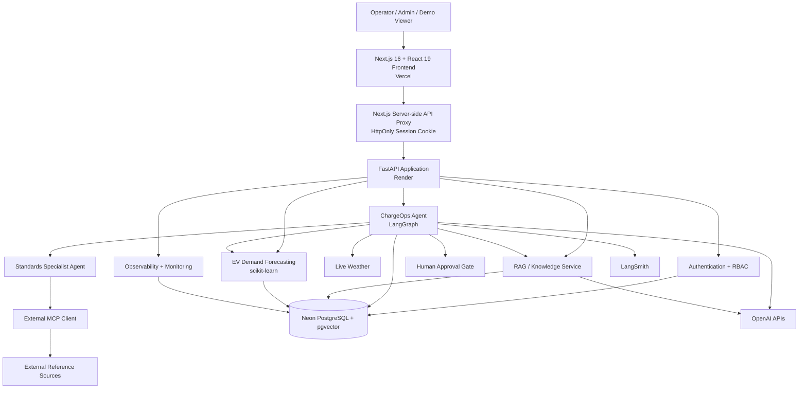

# ⚡ ChargeOps AI

**Agentic EV Charging Intelligence & Operations Platform**

[](https://github.com/zrasooli94/ChargeOps-AI/actions/workflows/ci-cd.yml)
[](https://nextjs.org/)
[](https://react.dev/)
[](https://www.python.org/)
[](https://fastapi.tiangolo.com/)
[](https://www.langchain.com/langgraph)
[](https://www.postgresql.org/)
[](https://vercel.com/)
[](https://render.com/)
[](https://neon.tech/)

**Live application:** https://chargeops-ai.vercel.app  
**API documentation:** https://chargeops-api.onrender.com/docs  
**Source:** https://github.com/zrasooli94/ChargeOps-AI

> **Portfolio note:** The public deployment uses portfolio-friendly cloud infrastructure. The Render API may require a short warm-up after a period of inactivity.

---

## 🔐 Live Demo Access

ChargeOps AI requires authentication.

A restricted **Viewer** account is available for portfolio review. The live login page is configured with the demo account so reviewers can explore the application without receiving operator or administrative privileges.

**Demo email:** `demo@chargeops.ai`

The Viewer role can explore:

- station intelligence
- agent workflows
- demand forecasting
- incidents
- knowledge retrieval
- system architecture

Privileged write operations, observability administration, knowledge management, and user management remain protected by RBAC.

---

## Overview

ChargeOps AI is a production-style **Generative AI and Agentic AI platform for EV charging operations**.

It combines:

- a modern **Next.js + React + TypeScript** frontend
- a secure **FastAPI** backend
- **LangGraph** agent orchestration
- **PostgreSQL + pgvector** retrieval
- machine-learning demand forecasting
- human-in-the-loop operational controls
- multi-agent standards research
- authentication and RBAC
- observability and evaluation
- Prometheus-compatible monitoring
- Docker and CI/CD
- production cloud deployment across **Vercel, Render, and Neon**

The core engineering goal is to demonstrate how an AI agent can operate against **trusted application state and real tools** rather than behave as a standalone chatbot.

---

# What ChargeOps Demonstrates

ChargeOps is designed around the concerns that matter in production AI engineering:

- **Agentic AI** with tool selection, conditional routing, persistent memory, and multi-step workflows
- **Retrieval-Augmented Generation** using OpenAI embeddings and PostgreSQL/pgvector
- **Human-in-the-loop safety** for protected operational changes
- **Deterministic authentication and RBAC** outside the LLM
- **Multi-agent delegation** for standards and research workflows
- **Model Context Protocol (MCP)** integrations for external reference access
- **Machine-learning forecasting** for EV charging demand
- **Observability and evaluation** for model and tool behavior
- **Production monitoring** through health checks, correlated logs, and Prometheus-compatible metrics
- **Secure frontend/backend separation** through a server-side Next.js API proxy
- **Cloud deployment** with automated GitHub, Vercel, Render, and Neon workflows

---

# Key Capabilities

## 🤖 Agentic EV Operations

The ChargeOps agent can reason over charging-station context and choose tools including:

- `get_station_details`
- `get_recent_incidents`
- `get_station_weather`
- `search_knowledge_base`
- `diagnose_charging_issue`
- `change_station_status`
- demand-forecasting tools
- standards-specialist delegation

The agent uses trusted runtime context rather than asking the LLM to invent operational state.

It can combine multiple tools in a single workflow. For example, the agent can retrieve station metadata, inspect recent incidents, check weather, query internal knowledge, and then produce an operational recommendation.

---

## 🧠 LangGraph Orchestration

ChargeOps uses LangGraph for stateful agent execution.

The graph supports:

- persistent threads
- checkpoint-backed memory
- conditional tool routing
- multi-step tool execution
- resumable workflows
- human approval interrupts
- protected write operations
- execution telemetry

Conceptually:

```text
User Request
    ↓
ChargeOps Agent
    ↓
Intent + Context Evaluation
    ↓
Tool Selection / Delegation
    ↓
Trusted Application Tools
    ↓
Optional Human Approval
    ↓
Final Grounded Response
```

---

## 📚 Retrieval-Augmented Generation

ChargeOps includes a production-style knowledge pipeline:

```text
Document Upload
      ↓
Validation
      ↓
Text Extraction
      ↓
Normalization
      ↓
Chunking
      ↓
OpenAI Embeddings
      ↓
Neon PostgreSQL + pgvector
      ↓
Semantic Retrieval
      ↓
Grounded Agent Answer
```

Knowledge features include:

- PDF, TXT, and Markdown ingestion
- OpenAI `text-embedding-3-small`
- 1536-dimensional embeddings
- pgvector HNSW cosine-similarity indexing
- retrieval similarity thresholds
- result deduplication and diversity controls
- source labels and citations
- duplicate-document protection
- admin-only ingestion and deletion

The public application exposes retrieval results and supporting sources so the RAG workflow is visible rather than hidden behind a generic chat interface.

---

## 📈 EV Charging Demand Forecasting

ChargeOps includes an EV demand forecasting subsystem built with scikit-learn.

The forecasting pipeline combines:

- historical charging demand
- temporal features
- weather features
- spatial/station features
- mobility signals
- lagged demand features

The frontend provides:

- 24-hour demand forecasts
- predicted hourly energy demand
- peak demand
- total forecast demand
- average hourly demand
- operational risk classification

> **Data disclosure:** The current public portfolio deployment uses simulated demonstration demand history to validate the forecasting and operational-intelligence pipeline. It should not be interpreted as production utility telemetry.

---

## 🚨 Incident Intelligence

ChargeOps exposes station incidents through the operations interface.

Capabilities include:

- station-specific incident history
- operational context for agent reasoning
- incident lifecycle visibility
- operator/admin status updates
- integration with agent diagnosis workflows

RBAC prevents Viewer accounts from performing privileged incident updates.

---

## 🧑‍⚖️ Human-in-the-Loop Operations

Protected station-status changes are never executed simply because an LLM requested them.

```text
User Request
    ↓
Agent Identifies Protected Action
    ↓
Server-side Authorization
    ↓
LangGraph Interrupt
    ↓
Human Approval Required
    ↓
Approve / Reject
    ↓
Resume Workflow
    ↓
Database Write Only If Authorized + Approved
```

The LLM cannot grant itself access.

This separates AI reasoning from application authorization and creates a deterministic safety boundary around operational writes.

---

# Authentication & RBAC

ChargeOps implements deterministic server-side authentication and authorization.

## Authentication

- PostgreSQL-backed users
- Argon2 password hashing
- JWT access tokens
- configurable token expiry
- active-account validation
- database role/account state checked on authenticated requests
- no public registration
- password hashes never returned by API responses
- access token stored by the Next.js server proxy in an **HttpOnly cookie**
- browser clients do not store FastAPI bearer tokens in `localStorage`

## Roles

| Capability | Viewer | Operator | Admin |
|---|:---:|:---:|:---:|
| View stations | ✅ | ✅ | ✅ |
| View incidents | ✅ | ✅ | ✅ |
| Search knowledge | ✅ | ✅ | ✅ |
| View indexed documents | ✅ | ✅ | ✅ |
| Safe agent queries | ✅ | ✅ | ✅ |
| Generate demand forecasts | ✅ | ✅ | ✅ |
| Update incident status | ❌ | ✅ | ✅ |
| Run operational diagnosis/write tools | ❌ | ✅ | ✅ |
| Resume protected HITL operations | ❌ | ✅ | ✅ |
| View observability | ❌ | ✅ | ✅ |
| Run direct analysis endpoint | ❌ | ✅ | ✅ |
| Upload knowledge documents | ❌ | ❌ | ✅ |
| Delete knowledge documents | ❌ | ❌ | ✅ |
| Manage users | ❌ | ❌ | ✅ |

The Next.js interface hides unavailable controls for usability, while FastAPI remains the authoritative security boundary.

The public demo uses the **Viewer** role so recruiters can explore the system safely without receiving write or administrative privileges.

---

# Multi-Agent + MCP Integration

ChargeOps includes a selective multi-agent architecture.

The main operations agent can delegate standards-related questions to a specialist agent, which can access external references through an MCP client.

```text
ChargeOps Supervisor
        ↓
Standards Specialist
        ↓
External MCP Client
        ↓
MCP Fetch Server
        ↓
External Standards / Reference Sources
```

External content is treated as untrusted reference material and does not bypass application authorization or operational safety controls.

---

# Observability & Evaluation

## Persistent Agent Telemetry

ChargeOps stores execution telemetry in PostgreSQL, including:

- run ID
- thread ID
- station ID
- user request
- model
- tools used
- execution trace
- latency
- status
- human-approval state
- final answer

The Next.js dashboard includes an observability interface and run inspector for authorized roles.

The observability interface surfaces information such as:

- completed agent runs
- average latency
- tool-call counts
- protected/human-approval runs
- recent execution history
- run-level inspection

## LangSmith

ChargeOps integrates LangSmith for AI tracing and evaluation.

Evaluation workflows cover:

- deterministic tool selection
- required tool ordering
- protected-action behavior
- station context handling
- semantic answer quality
- RAG groundedness
- retrieval relevance
- citation validity
- citation faithfulness

## Production Monitoring

The API exposes a protected Prometheus-compatible `/metrics` endpoint with:

- HTTP request counts
- route/status tracking
- request-latency histograms
- in-flight request gauges
- unhandled exception counters
- standard Python/process metrics

Production monitoring also uses:

- Render health checks
- Render service metrics
- correlated request logs
- application request IDs
- deployment/failure notifications
- Neon database monitoring

---

# Frontend Experience

The current ChargeOps frontend is built with **Next.js 16, React 19, and TypeScript** using the App Router.

It replaces the original Streamlit portfolio interface with a responsive product-style control plane.

Key frontend capabilities include:

- animated landing experience
- responsive desktop/mobile navigation
- shared charging-station context
- role-aware navigation and controls
- Agent workspace with persistent thread IDs
- human approval/resume flows
- demand forecasting interface
- incident management views
- semantic knowledge search
- admin document upload/delete
- observability run explorer
- admin user/RBAC management
- system architecture view
- server-side authentication proxy
- HttpOnly session handling

---

# System Architecture



---

# Production Deployment

The current public portfolio environment is deployed as:

```text
Browser
   ↓ HTTPS
Vercel
Next.js Frontend
   ↓ Server-side Proxy
Render
FastAPI Backend
   ↓ TLS
Neon
PostgreSQL + pgvector
```

## Live Endpoints

| Service | Platform | URL |
|---|---|---|
| Frontend | Vercel | https://chargeops-ai.vercel.app |
| API | Render | https://chargeops-api.onrender.com |
| API Docs | Render | https://chargeops-api.onrender.com/docs |
| API Liveness | Render | https://chargeops-api.onrender.com/health/live |
| API Readiness | Render | https://chargeops-api.onrender.com/health/ready |
| Database | Neon | Private connection |

The browser communicates with the Next.js application. Authenticated API traffic is proxied server-side to FastAPI, and database credentials, AI secrets, and access tokens remain outside browser-accessible storage.

---

# Technology Stack

| Layer | Technologies |
|---|---|
| AI / Agents | OpenAI Responses API, Structured Outputs, Function Calling, LangGraph |
| RAG | OpenAI Embeddings, PostgreSQL, pgvector, HNSW |
| Multi-Agent / Integration | Specialist agent, MCP |
| Machine Learning | scikit-learn, pandas, NumPy |
| Backend | Python 3.11, FastAPI, Pydantic |
| Database | Neon PostgreSQL, SQLAlchemy Async, Alembic |
| Security | JWT, PyJWT, pwdlib/Argon2, RBAC, HttpOnly cookies, CORS/HSTS hardening |
| Frontend | Next.js 16, React 19, TypeScript 5.8, App Router |
| Observability | LangSmith, PostgreSQL run telemetry, Prometheus client |
| Testing | Pytest, Ruff |
| DevOps | Docker, Docker Compose, GitHub Actions |
| Cloud | Vercel, Render, Neon |

---

# Project Structure

```text
ChargeOps-AI/
├── .github/
│   └── workflows/
│       └── ci-cd.yml
├── alembic/
│   ├── env.py
│   └── versions/
├── app/
│   ├── agents/
│   │   ├── chargeops_graph.py
│   │   └── standards_specialist.py
│   ├── api/
│   │   ├── agent.py
│   │   ├── analysis.py
│   │   ├── auth.py
│   │   ├── chat.py
│   │   ├── forecast.py
│   │   ├── health.py
│   │   ├── incidents.py
│   │   ├── knowledge.py
│   │   ├── observability.py
│   │   ├── stations.py
│   │   ├── users.py
│   │   └── weather.py
│   ├── core/
│   │   ├── auth_dependencies.py
│   │   ├── checkpointing.py
│   │   ├── config.py
│   │   ├── database.py
│   │   ├── monitoring.py
│   │   ├── production_security.py
│   │   ├── security.py
│   │   └── security_headers.py
│   ├── mcp/
│   ├── ml/
│   │   └── forecasting/
│   ├── models/
│   ├── schemas/
│   ├── services/
│   └── main.py
├── frontend-next/
│   ├── app/
│   │   ├── api/
│   │   ├── dashboard/
│   │   ├── globals.css
│   │   ├── layout.tsx
│   │   └── page.tsx
│   ├── components/
│   │   ├── auth/
│   │   ├── dashboard/
│   │   └── hero/
│   ├── lib/
│   │   ├── api.ts
│   │   └── types.ts
│   ├── package.json
│   ├── next.config.ts
│   └── tsconfig.json
├── frontend/
│   └── app.py                 # legacy Streamlit frontend
├── docs/
│   ├── DEMO.md
│   ├── diagrams/
│   └── screenshots/
├── evals/
├── scripts/
├── tests/
├── Dockerfile
├── docker-compose.yml
├── alembic.ini
├── requirements.txt
└── README.md
```

---

# Local Development

## 1. Clone the Repository

```bash
git clone https://github.com/zrasooli94/ChargeOps-AI.git
cd ChargeOps-AI
```

## 2. Start the Backend Environment

```bash
python3.11 -m venv .venv
source .venv/bin/activate
python -m pip install -r requirements.txt
```

## 3. Configure Backend Environment Variables

```bash
cp .env.example .env
```

Add your local backend configuration and secrets to `.env`.

> Never commit `.env`, API keys, JWT secrets, monitoring tokens, database credentials, or production secrets.

## 4. Start PostgreSQL for Local Development

```bash
docker compose up -d
docker compose ps
```

## 5. Apply Database Migrations

```bash
python -m alembic upgrade head
```

## 6. Prepare the Demonstration Forecasting Model

```bash
python -m scripts.train_demand_forecast --generate-demo
```

## 7. Start FastAPI

```bash
uvicorn app.main:app --reload
```

Backend:

```text
http://127.0.0.1:8000
```

API documentation:

```text
http://127.0.0.1:8000/docs
```

## 8. Configure the Next.js Frontend

Open a second terminal:

```bash
cd frontend-next
cp .env.example .env.local
```

Example local frontend environment:

```env
CHARGEOPS_API_URL=http://127.0.0.1:8000
CHARGEOPS_DEMO_EMAIL=demo@chargeops.ai
CHARGEOPS_DEMO_PASSWORD=replace-with-your-local-demo-password
```

## 9. Start Next.js

```bash
npm install
npm run dev
```

Frontend:

```text
http://localhost:3000
```

The Next.js server proxies authenticated API traffic to FastAPI.

---

# Docker

Build the backend application image:

```bash
docker build -t chargeops-ai:local .
```

Or start the local backend/database stack:

```bash
docker compose up --build -d
docker compose ps
```

The container startup flow prepares database migrations and demonstration forecasting assets before starting the API service.

The production Next.js frontend is deployed independently through Vercel.

---

# Quality Checks

## Backend

Run Ruff:

```bash
python -m ruff check .
```

Run the test suite:

```bash
python -m pytest -q
```

Check migrations:

```bash
python -m alembic current
```

## Frontend

```bash
cd frontend-next
npm run build
```

## Repository

Check whitespace before committing:

```bash
git diff --check
```

---

# CI/CD

ChargeOps uses automated validation and cloud deployment.

```text
Push / Pull Request
       ↓
GitHub Actions
       ↓
Ruff + Pytest
       ↓
PostgreSQL / pgvector integration
       ↓
Alembic migration validation
       ↓
Docker build
       ↓
Backend Deployment → Render
       ↓
Frontend Deployment → Vercel
       ↓
Database → Neon
```

The Next.js project is deployed from the `frontend-next/` root directory on Vercel.

---

# Recommended Recruiter Demo Flow

1. Open https://chargeops-ai.vercel.app.
2. Sign in with the restricted Viewer demo account.
3. Select a charging station.
4. Ask the Agent for station status and operational concerns.
5. Ask for current weather and its operational impact.
6. Generate a 24-hour demand forecast.
7. Ask an OCPP or EV-charging troubleshooting question to exercise RAG.
8. Review station incidents and operational context.
9. Explore knowledge retrieval and supporting sources.
10. Review the System page for architecture and platform design.

Privileged features such as operator actions, human-approved write workflows, observability, knowledge administration, and user management are role protected.

For an extended walkthrough, see [`docs/DEMO.md`](docs/DEMO.md).

---

# Engineering Principles

ChargeOps intentionally follows several production-oriented rules:

- authorization is deterministic and server-side
- LLM output never grants access
- protected writes require human approval
- secrets stay out of source control and browser configuration
- bearer tokens are not stored in browser `localStorage`
- external reference content is treated as untrusted
- RAG answers expose supporting knowledge sources
- agent executions are observable and evaluable
- health/readiness are distinct from business logic
- metrics avoid unbounded high-cardinality labels
- synthetic demonstration data is clearly labeled as synthetic
- public demo access uses a restricted account rather than administrative credentials
- frontend failures do not define backend authorization state

---

# Current Limitations

- The forecasting subsystem currently uses simulated demonstration demand history rather than utility production telemetry.
- The Render API may cold-start after inactivity depending on hosting configuration.
- External services remain subject to their own availability and rate limits.
- The public demo account intentionally has restricted permissions.
- ChargeOps demonstrates EV charging operations intelligence; it is not connected to live charging hardware or a production charging network.

---

# Roadmap

## Completed

- ✅ Software + AI foundation
- ✅ Structured GenAI
- ✅ External integrations
- ✅ PostgreSQL operational intelligence
- ✅ RAG and document ingestion
- ✅ LangGraph agent orchestration
- ✅ Persistent memory/checkpointing
- ✅ Human-in-the-loop workflows
- ✅ LangSmith observability and evaluation
- ✅ Authentication and RBAC
- ✅ Security hardening
- ✅ Production reliability
- ✅ MCP integrations
- ✅ Selective multi-agent architecture
- ✅ EV demand forecasting
- ✅ Docker containerization
- ✅ CI/CD
- ✅ FastAPI cloud deployment on Render
- ✅ PostgreSQL + pgvector migration to Neon
- ✅ Next.js frontend migration
- ✅ Vercel production deployment
- ✅ Production monitoring
- ✅ Portfolio release

## Next

- real-world EV charging dataset validation
- richer forecasting/model comparison and evaluation
- production monitoring dashboards and alerting
- additional OCPP/charging-network integrations
- richer multi-station operational analytics
- expanded automated agent evaluation datasets

---

# Security

Please do not report sensitive credentials or personal data through public GitHub issues.

The public demo account is deliberately restricted and is not an administrative credential.

Production secrets are supplied through deployment environment variables and are not committed to the repository.

ChargeOps is a portfolio/research system and should not be used to control real charging infrastructure without additional security review, operational validation, and production hardening.

---

# License

A project license has not yet been selected.

---

# Author

**Zaker Hussain Rasooli**

Full-Stack Developer · AI Engineering · Agentic AI

GitHub: https://github.com/zrasooli94

---

## For Reviewers

If you are reviewing this project for an AI / GenAI / Agentic AI engineering role, recommended starting points are:

1. [`app/agents/chargeops_graph.py`](app/agents/chargeops_graph.py) — LangGraph orchestration
2. [`app/services/agent_tools.py`](app/services/agent_tools.py) — operational tool layer
3. [`app/mcp/`](app/mcp/) — MCP integrations
4. [`app/ml/forecasting/`](app/ml/forecasting/) — EV demand forecasting
5. [`app/core/`](app/core/) — authentication, security, reliability, and monitoring
6. [`frontend-next/`](frontend-next/) — production Next.js frontend and server-side API proxy
7. [`evals/`](evals/) — evaluation assets
8. [`tests/`](tests/) — regression, security, and agent tests

---

## Production Stack at a Glance

```text
┌────────────────────────────────────────────┐
│                  Vercel                    │
│      Next.js 16 + React 19 + TypeScript    │
│   UI + HttpOnly-cookie server API proxy    │
└──────────────────────┬─────────────────────┘
                       │ HTTPS
                       ▼
┌────────────────────────────────────────────┐
│                  Render                    │
│             FastAPI Backend                │
│ Auth · Agents · RAG · Forecast · Metrics   │
└──────────────────────┬─────────────────────┘
                       │ TLS
                       ▼
┌────────────────────────────────────────────┐
│                   Neon                     │
│        PostgreSQL 17 + pgvector 0.8        │
│ Users · Incidents · RAG · Agent Memory     │
└────────────────────────────────────────────┘
```

**Live:** https://chargeops-ai.vercel.app
