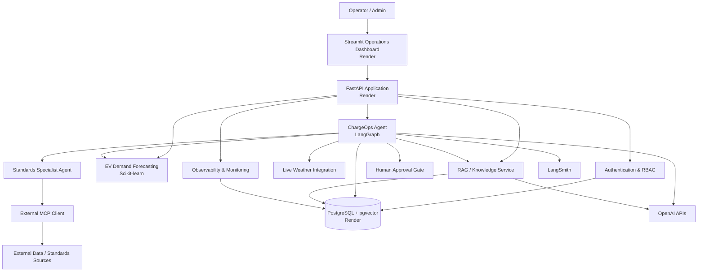

# ChargeOps AI — System Architecture

```mermaid
flowchart TB
    User["Operator / Admin"]

    UI["Streamlit Operations Dashboard<br/>Render"]

    API["FastAPI Application<br/>Render"]

    Auth["Authentication & RBAC"]
    Agent["ChargeOps Agent<br/>LangGraph"]
    Forecast["EV Demand Forecasting<br/>Scikit-learn"]
    Knowledge["RAG / Knowledge Service"]
    Weather["Live Weather Integration"]
    Standards["Standards Specialist Agent"]
    MCP["External MCP Client"]
    HITL["Human Approval Gate"]
    Observability["Observability & Monitoring"]

    DB[("PostgreSQL + pgvector<br/>Render")]

    OpenAI["OpenAI APIs"]
    External["External Data / Standards Sources"]
    LangSmith["LangSmith"]

    User --> UI
    UI --> API

    API --> Auth
    API --> Agent
    API --> Forecast
    API --> Knowledge
    API --> Observability

    Agent --> Weather
    Agent --> Knowledge
    Agent --> Forecast
    Agent --> Standards
    Agent --> HITL

    Standards --> MCP
    MCP --> External

    Agent --> OpenAI
    Knowledge --> OpenAI

    Auth --> DB
    Agent --> DB
    Knowledge --> DB
    Observability --> DB

    Agent --> LangSmith
```